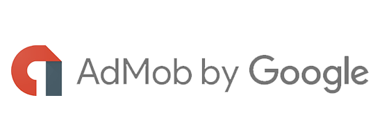
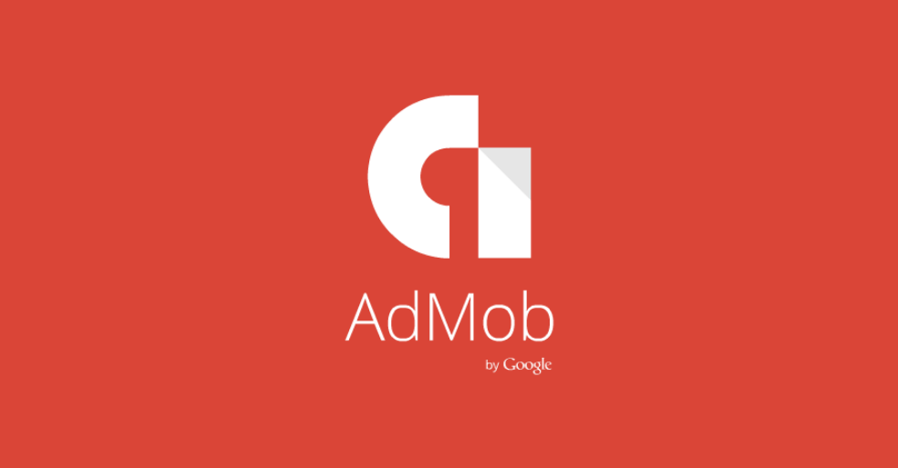
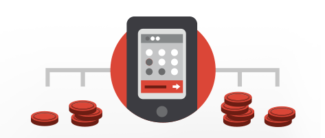
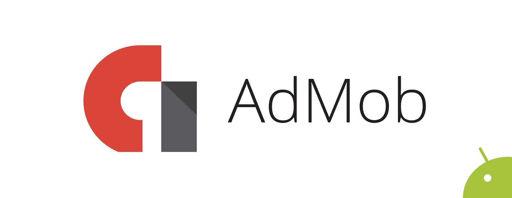
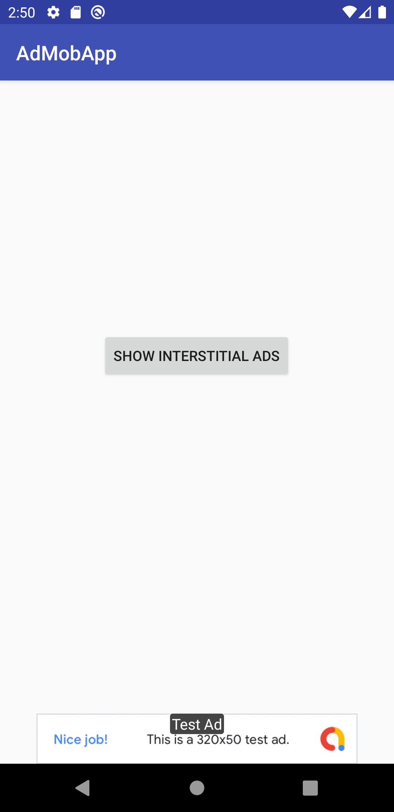
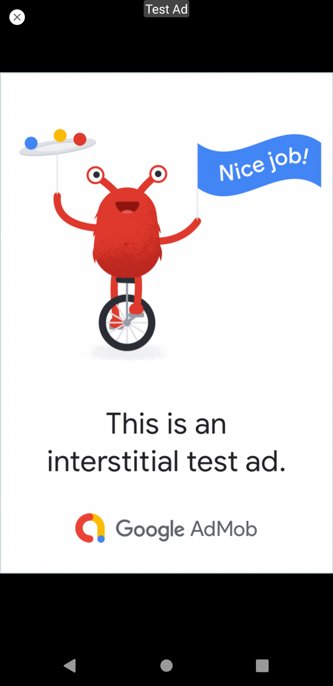
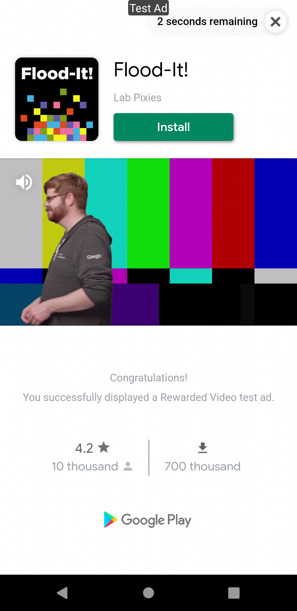

# AdMob 🤑 App 📱



It is an Android project with AdMob usage and examples. There are examples of 3 types of advertisement in our project. These ad types are: **Banner**, **Interstitial** and **Rewarded**. Application is developed using Android Emulator.

<br>

## What is AdMob❓



AdMob is an advertising service that enables mobile app developers to generate revenue.
It should not be confused with AdSense and AdWords, which are the advertising services Google offers for websites.
To put it more simply; AdMob allows you to earn money by adding ads to your mobile app.
Originally founded by Omar Hamoui in 2006 and purchased by Google in November 2009 for $ 750 million
AdMob is one of the most preferred revenue generating models in the Android world, bringing advertisers and developers together.
AdMob offers revenue based on the rate of clicks on ads, rather than charging based on the number of downloads of apps.
You can earn high earnings based on the popularity of your application, thanks to which users show ads according to the categories they are interested in. <br>


<br>

## How can I apply❓



Developers with existing AdSense accounts can sync this account with AdMob for mobile applications and start using it immediately. If you do not have an advertising account, you can click here to apply immediately. AdMob not only provides revenue,
helps you learn your audience as well. Thanks to AdMob's advanced reporting system, from which country, clicks
from which age range, what kind of device you buy, how many people started to follow your application after an update.
etc. You can see many important information in detail. If you wish, you can also use the Google Analytics service in AdMob.
In this way, you can also get detailed information about the audience using your application.
In the light of this information, it is possible to reach more users by making new plans.


<br>

## Who uses it❓



AdMob is used in over 650,000 apps today. Google has paid over $ 1 billion to its developers using the AdMob service. Since 2013, there has been an increase of 200 percent in CPM values. AdMob, which has over 200 billion ad impressions per month, reaches more and more users every day and contributes to the development of the ecosystem. You can use AdMob, which is preferred by over 1 million advertisers, not only for Android but also on iOS platforms.

<br>

## Screenshots 🖼
 ||  || 

## License ℹ️
```
MIT License

Copyright (c) 2022 Halil OZEL

Permission is hereby granted, free of charge, to any person obtaining a copy
of this software and associated documentation files (the "Software"), to deal
in the Software without restriction, including without limitation the rights
to use, copy, modify, merge, publish, distribute, sublicense, and/or sell
copies of the Software, and to permit persons to whom the Software is
furnished to do so, subject to the following conditions:

The above copyright notice and this permission notice shall be included in all
copies or substantial portions of the Software.

THE SOFTWARE IS PROVIDED "AS IS", WITHOUT WARRANTY OF ANY KIND, EXPRESS OR
IMPLIED, INCLUDING BUT NOT LIMITED TO THE WARRANTIES OF MERCHANTABILITY,
FITNESS FOR A PARTICULAR PURPOSE AND NONINFRINGEMENT. IN NO EVENT SHALL THE
AUTHORS OR COPYRIGHT HOLDERS BE LIABLE FOR ANY CLAIM, DAMAGES OR OTHER
LIABILITY, WHETHER IN AN ACTION OF CONTRACT, TORT OR OTHERWISE, ARISING FROM,
OUT OF OR IN CONNECTION WITH THE SOFTWARE OR THE USE OR OTHER DEALINGS IN THE
SOFTWARE.
```
