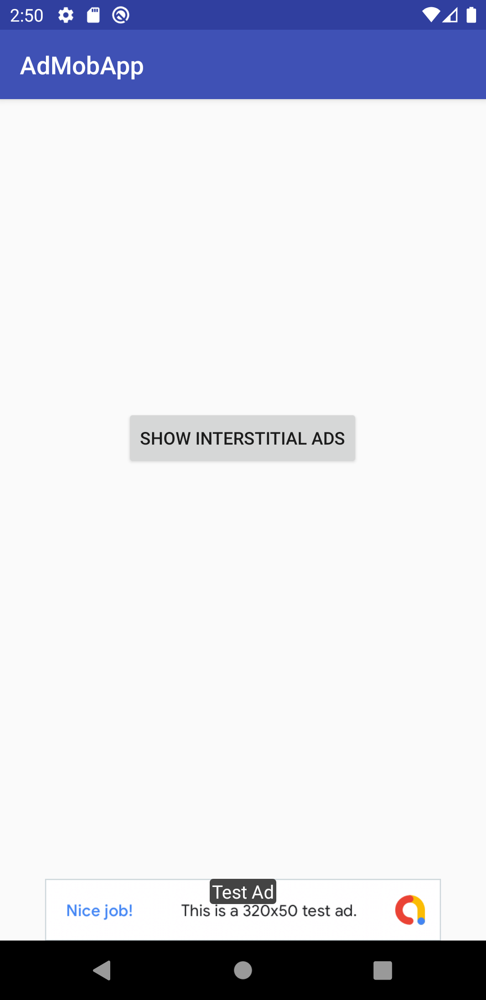
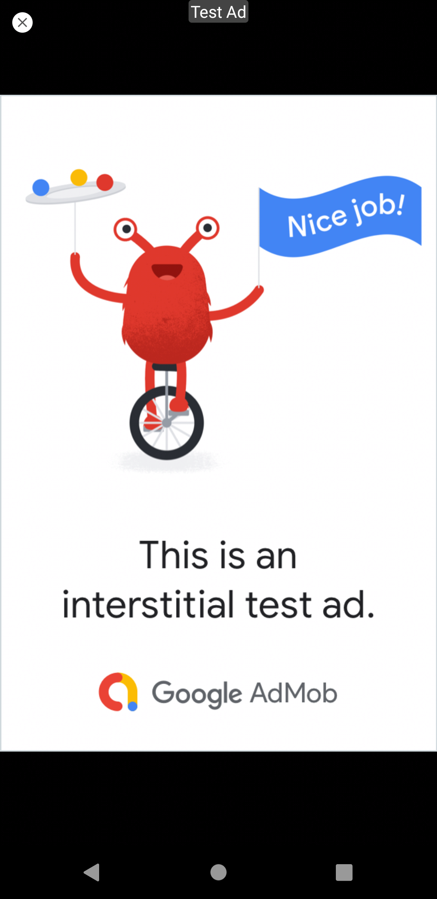
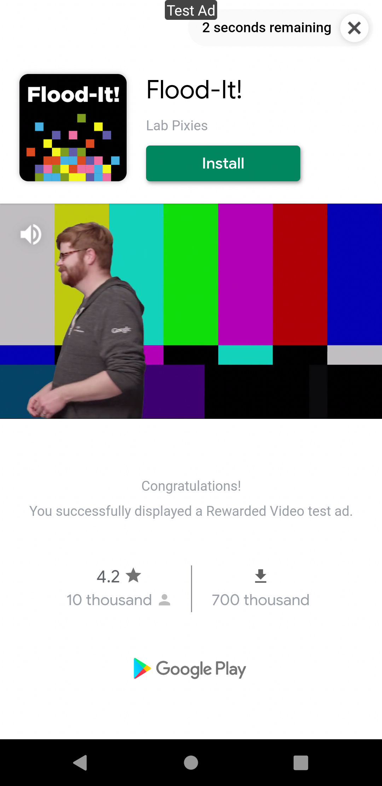

# AdMob 2026 Android Sample 🤑📱


A modern Android sample project that demonstrates how to integrate Google AdMob banner, interstitial, and rewarded ads with the Google Mobile Ads SDK. The project is intentionally small and focused, making it useful for learning the ad lifecycle, testing demo ad units, and adapting the implementation to a production app.

> This repository uses Google's official sample ad unit IDs so you can run and test the app safely. Replace them with your own AdMob App ID and ad unit IDs before publishing an app to Google Play.

## What This App Demonstrates

This app contains practical examples for the three most common AdMob ad formats used in Android apps:

1. **Banner Ads** displayed at the bottom of the main screen.
2. **Interstitial Ads** shown as a full-screen transition before opening the second screen.
3. **Rewarded Ads** shown as a full-screen rewarded experience that reports the earned reward to the user.

The implementation is designed to be easy to read and extend. It uses `ViewBinding`, explicit ad-loading functions, full-screen content callbacks, and banner lifecycle methods so each ad type has a clear responsibility.

## 2026 Modernization

The project has been updated for a modern Android development setup:

| Area | Version / Choice |
| --- | --- |
| Android Gradle Plugin | `9.2.0` |
| Gradle Wrapper | `9.4.1` |
| Kotlin Android Plugin | `2.4.0` |
| Compile SDK | `36` |
| Target SDK | `36` |
| Minimum SDK | `23` |
| Java / Kotlin Toolchain | `17` |
| Google Mobile Ads SDK | `25.3.0` |
| UI Toolkit | XML layouts with Material Components |

Key modernization highlights:

- Migrated Gradle configuration to the plugins DSL.
- Centralized repository configuration in `settings.gradle`.
- Updated SDK targets for Android 16 / API 36.
- Replaced legacy Android support dependencies with AndroidX dependencies.
- Removed unnecessary multidex configuration for the current minimum SDK.
- Added Material Components for a cleaner, modern sample UI.
- Updated ad loading and full-screen callback handling for clearer behavior.
- Added banner lifecycle handling with `resume()`, `pause()`, and `destroy()`.

## Tech Stack

- **Language:** Kotlin
- **UI:** XML layouts, ConstraintLayout, Material Components
- **Ads:** Google Mobile Ads SDK for Android
- **Build System:** Gradle with Android Gradle Plugin
- **Architecture:** Simple Activity-based demo flow

## Project Structure

```text
AdMobApp/
├── app/
│   ├── build.gradle
│   └── src/main/
│       ├── AndroidManifest.xml
│       ├── java/com/halil/ozel/admobapp/
│       │   ├── MainActivity.kt
│       │   └── SecondActivity.kt
│       └── res/
│           ├── layout/
│           │   ├── activity_main.xml
│           │   └── activity_second.xml
│           └── values/
│               ├── colors.xml
│               ├── strings.xml
│               └── styles.xml
├── build.gradle
├── settings.gradle
└── gradle/wrapper/gradle-wrapper.properties
```

Important files:

- `MainActivity.kt` initializes Mobile Ads, loads all ad formats, shows interstitial/rewarded ads, and manages banner lifecycle events.
- `activity_main.xml` contains the modern demo UI and the banner `AdView`.
- `AndroidManifest.xml` contains the AdMob App ID metadata required by the Mobile Ads SDK.
- `app/build.gradle` defines the Android SDK targets and dependency versions.

## Ad Formats

| Format | Where It Appears | Behavior |
| --- | --- | --- |
| Banner | Bottom of the main screen | Loads after `MobileAds.initialize()` and follows the Activity lifecycle. |
| Interstitial | Main screen button | Shows a full-screen ad when available, then opens the second screen after dismissal. |
| Rewarded | Main screen button | Shows a rewarded ad when available, displays the reward amount/type, then opens the second screen after dismissal. |

## How the Ad Flow Works

1. `MainActivity` inflates the layout using `ActivityMainBinding`.
2. `MobileAds.initialize()` is called during `onCreate()`.
3. After initialization, the app starts loading:
   - the banner ad,
   - the interstitial ad,
   - the rewarded ad.
4. When the user taps **Show Interstitial Ad**, the app:
   - shows the cached interstitial ad if it is ready,
   - registers a full-screen callback,
   - reloads the next interstitial after dismissal or show failure,
   - opens `SecondActivity` when the ad flow is complete.
5. When the user taps **Show Rewarded Ad**, the app:
   - shows the cached rewarded ad if it is ready,
   - displays the reward amount and reward type,
   - reloads the next rewarded ad after dismissal or show failure,
   - opens `SecondActivity` when the ad flow is complete.
6. If an ad is not ready yet, the app shows a short message, starts loading another ad, and continues the demo flow.

## Getting Started

### Prerequisites

Install the following tools before opening the project:

- Android Studio Meerkat or newer.
- Android SDK Platform 36.
- JDK 17 or a newer JDK compatible with the configured Gradle/AGP versions.
- A device or emulator with Google Play services.

### Clone the Repository

```bash
git clone https://github.com/halilozel1903/AdMobApp.git
cd AdMobApp
```

### Open in Android Studio

1. Open Android Studio.
2. Select **Open** and choose the project folder.
3. Wait for Gradle sync to finish.
4. Select an emulator or physical device.
5. Run the `app` configuration.

## Build and Run

Build the debug APK from the command line:

```bash
./gradlew assembleDebug
```

Install the debug APK on a connected device:

```bash
./gradlew installDebug
```

Run unit and instrumentation checks as needed:

```bash
./gradlew test
./gradlew connectedAndroidTest
```

## Replacing Test Ad IDs

The project currently uses Google sample ad IDs. These are safe for development and do not generate real revenue.

Before releasing your own app:

1. Create or open your app in the [AdMob console](https://admob.google.com/).
2. Replace the AdMob App ID in `AndroidManifest.xml`:

```xml
<meta-data
    android:name="com.google.android.gms.ads.APPLICATION_ID"
    android:value="ca-app-pub-your-app-id" />
```

3. Replace the banner ad unit ID in `activity_main.xml`:

```xml
app:adUnitId="ca-app-pub-your-banner-unit-id"
```

4. Replace the interstitial and rewarded ad unit IDs in `MainActivity.kt`:

```kotlin
private const val INTERSTITIAL_AD_UNIT_ID = "ca-app-pub-your-interstitial-unit-id"
private const val REWARDED_AD_UNIT_ID = "ca-app-pub-your-rewarded-unit-id"
```

5. Test thoroughly with test devices before publishing.

## Best Practices Included

This sample includes several practices that are useful in real Android apps:

- Uses official Google test ad IDs during development.
- Loads full-screen ads ahead of time instead of loading only at click time.
- Keeps nullable references for interstitial and rewarded ads because loaded ads are single-use.
- Clears consumed full-screen ads and reloads the next ad after dismissal or failure.
- Uses `FullScreenContentCallback` to coordinate post-ad navigation.
- Manages banner ad lifecycle with Activity lifecycle methods.
- Keeps UI strings in resources for easier localization.
- Uses Material Components for a more modern interface.

## Troubleshooting

### Gradle sync fails

Make sure Android Studio has installed the Android SDK Platform 36 package and that your network can access Google's Maven repository and the Gradle distribution service.

### Ads do not appear

Check the following:

- The device or emulator has Google Play services installed.
- The app has internet access.
- You are using test ad IDs during development.
- You waited long enough for the ad request to complete.
- Logcat does not show AdMob configuration or policy errors.

### App crashes on startup with an AdMob error

Verify that `AndroidManifest.xml` contains a valid `com.google.android.gms.ads.APPLICATION_ID` metadata entry.

### Interstitial or rewarded ad only shows once

This is expected behavior. Full-screen ads are single-use, so the sample reloads a new ad after the previous one is dismissed or fails to show.

## Screenshots 🖼

 ||  || 

## Related Blog Posts 📚

- [Android Admob Ad](https://halilozel1903.medium.com/androidde-admob-kullanımı-757ecbd609ac) 🏦
- [Android Banner Ad](https://halilozel1903.medium.com/android-banner-reklam-518d8b910938) 💵
- [Android Interstitial Ad](https://halilozel1903.medium.com/android-interstitial-reklam-8b1cbd827703) 💶
- [Android Rewarded Ad](https://halilozel1903.medium.com/android-rewarded-reklam-1d6788c9f6f5) 💷

## Support 💸

If this project helps you, you can support the maintainer with a coffee. ☕

[](https://www.buymeacoffee.com/halilozel1903)

## License ℹ️

```text
MIT License

Copyright (c) 2022 Halil OZEL

Permission is hereby granted, free of charge, to any person obtaining a copy
of this software and associated documentation files (the "Software"), to deal
in the Software without restriction, including without limitation the rights
to use, copy, modify, merge, publish, distribute, sublicense, and/or sell
copies of the Software, and to permit persons to whom the Software is
furnished to do so, subject to the following conditions:

The above copyright notice and this permission notice shall be included in all
copies or substantial portions of the Software.

THE SOFTWARE IS PROVIDED "AS IS", WITHOUT WARRANTY OF ANY KIND, EXPRESS OR
IMPLIED, INCLUDING BUT NOT LIMITED TO THE WARRANTIES OF MERCHANTABILITY,
FITNESS FOR A PARTICULAR PURPOSE AND NONINFRINGEMENT. IN NO EVENT SHALL THE
AUTHORS OR COPYRIGHT HOLDERS BE LIABLE FOR ANY CLAIM, DAMAGES OR OTHER
LIABILITY, WHETHER IN AN ACTION OF CONTRACT, TORT OR OTHERWISE, ARISING FROM,
OUT OF OR IN CONNECTION WITH THE SOFTWARE OR THE USE OR OTHER DEALINGS IN THE
SOFTWARE.
```
